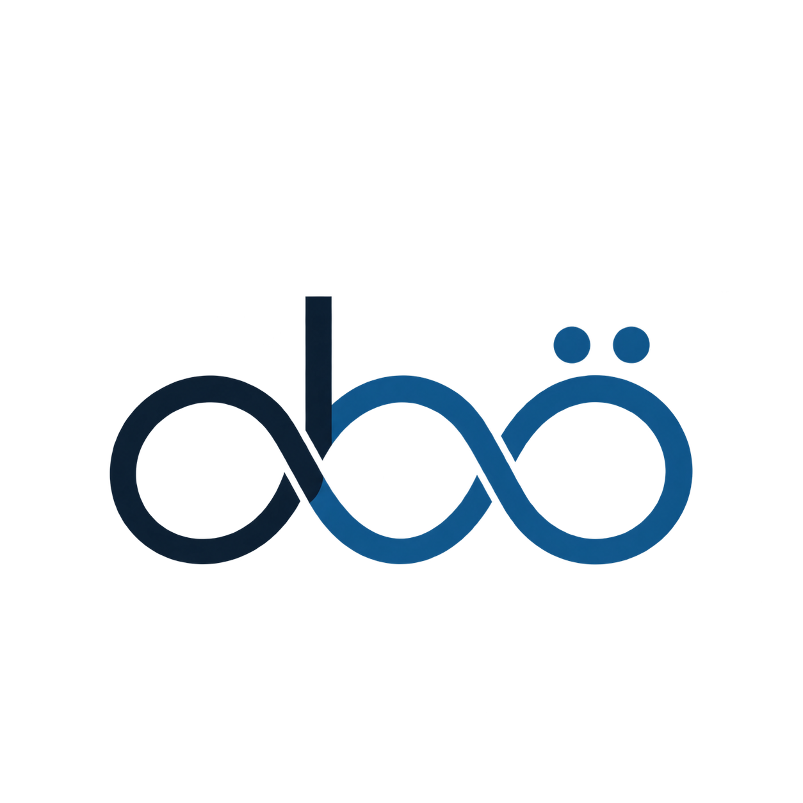

  

<h1 align="center">Oğuzhan Berke Özdil</h1>

  <strong>PhD researcher in Computer Science at AGH University of Krakow</strong> 
  Experimental systems, vibroacoustic signals and reliable machine learning

  <a href="https://oguzhanberkeozdil.github.io/">Research website</a> &nbsp;|&nbsp;
  <a href="https://www.linkedin.com/in/oguzhanberkeozdil/">LinkedIn</a> &nbsp;|&nbsp;
  <a href="mailto:ozdiloguzhanberke@gmail.com">Email</a>

I am a Turkish researcher and software developer based in Krakow. My work connects physical experiments, signal processing and machine learning. I am especially interested in how data are produced, how experimental conditions shape a signal, and what must be checked before a model result can be trusted.

## Current research

My doctoral topic is **Vibroacoustic Tissue Fingerprinting using Machine and Deep Learning for application in Robotic Assisted Needle and Therapy Procedures**, supervised by [Prof. Michael Friebe, PhD](https://healthtech-innovation.agh.edu.pl/team/).

The research asks whether vibroacoustic signals measured near a medical tool can provide reliable information about tissue and layer transitions when the tool, operator, session and sensor conditions change. The work combines experimental acquisition, acoustic signal analysis, grouped validation and uncertainty-aware modelling.

[Read the research overview and official topic details](https://oguzhanberkeozdil.github.io/#research)

## Projects

### VIBRONAV

An ongoing research line for vibroacoustic support in minimally invasive procedures. I joined through website and software development, then moved into experimental setup, manual and robot-assisted acquisition, data-quality review, and Python/API automation for repeatable Dobot MG400 puncture sequences at AGH.

[AGH project page](https://healthtech-innovation.agh.edu.pl/vibranov-project/) | [Current VIBRONAV project](https://medsun.pl/en/vibronav/)

### UltraClear

A completed research project on handheld hybrid SPECT and ultrasound imaging. My work included prototype testing, signal and data software, 3D components, and hardware-software integration.

[Official UltraClear project page](https://medsun.pl/ultraclear-src/index_ang.html)

## Selected publications

- **Comparative Vibroacoustic Analysis of Spinal Needle Insertion Actions: Quincke vs. Sprotte**, BMT 2026. First and corresponding author, accepted conference contribution.
- [**Vibroacoustic signatures: proof of concept for simple material characterization during needle interventions**](https://doi.org/10.1007/s11548-025-03492-0), *International Journal of Computer Assisted Radiology and Surgery*, 2025.
- [**Development of a Test Environment for the Validation of Needle-Mounted Vibroacoustic Sensors**](https://doi.org/10.1109/EMBC58623.2025.11254405), *IEEE EMBC*, 2025.
- [**Initial findings creating a temperature prediction model using vibroacoustic signals originating from tissue needle interactions**](https://doi.org/10.1038/s41598-025-92202-6), *Scientific Reports*, 2025.

[See contribution notes for each publication](https://oguzhanberkeozdil.github.io/#publications)

## Engineering work

Alongside the PhD, I work as a **ServiceNow Developer at EY GDS Poland**. My engineering background includes Python automation, REST APIs, React and TypeScript, Java with Spring, SQL, Git, Docker and software testing.

`Python` `Signal processing` `scikit-learn` `XGBoost` `Machine learning` `TypeScript` `React` `Java` `Spring` `ServiceNow` `REST APIs` `SQL` `Docker` `Git`

## Student collaboration

I welcome conversations with BSc and MSc students interested in experimental acquisition, signal processing, machine learning or reproducible evaluation. I can support day-to-day research work; formal supervision and topic approval are handled through Prof. Friebe and AGH.

[Research and thesis collaboration](https://oguzhanberkeozdil.github.io/#students)

## Beyond the lab

Lord of the Rings, fantasy and history books, PC games, strength training, cycling, hiking, climbing, canoeing and dance all compete for the hours left after research and software work.
